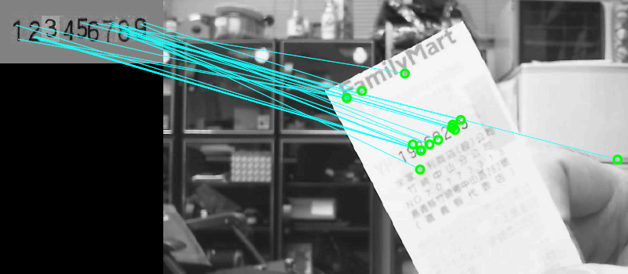
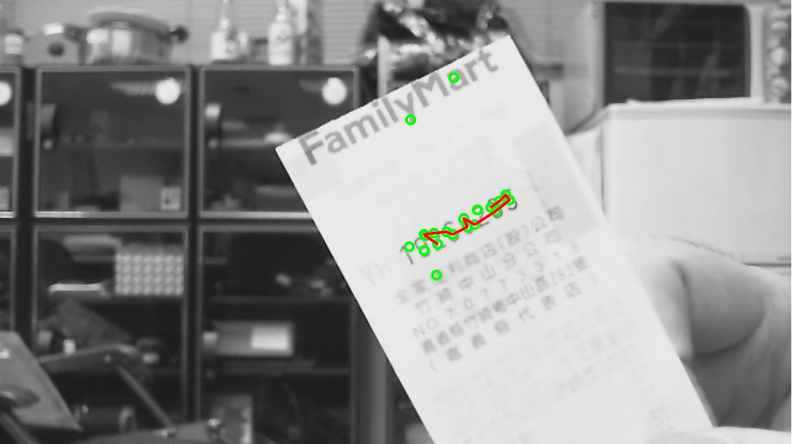

# SCFlow

This repository provides the <b>OCR</b>(C++) & <b>SCR</b>(MATLAB) implementation for the following paper:

**Structured Cluster Detection from Local Feature Learning for Text Region Extraction** 
[Huei-Yung Lin](https://vision.ee.ccu.edu.tw/hueiyung/) and [Chin-Yu Hsu](mailto:chinyu.hsu@gmail.com)
In MDPI 2023. 
> **Abstract:** *The detection of interested regions is commonly considered as an early stage of information extraction from images. It is used to provide the contents meaningful to the human perception for machine vision applications. In this work, a new technique for structured region detection based on the distillation of local image features with clustering analysis is proposed. Different from the existing methods, our approach takes the application-specific reference images for feature learning and extraction. It is able to identify the text clusters under the sparsity of feature points derived from the characters. For the localization of structured regions, the cluster with a high feature density is calculated and served as a candidate for region expansion. An iterative adjustment is then performed to enlarge the ROI for complete text coverage. The experiments carried out for text region detection of invoice and banknote have demonstrated the effectiveness of the proposed technique.*

# Features
**Local Feature Learning** 

**Structured Cluster Detection** 

